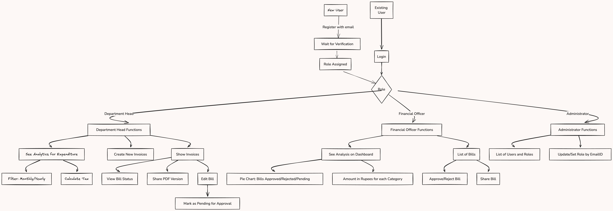

## Tasks Accomplished

- [x] **Task 1:** Implemented Role-Based Access Control (RBAC) for user management.
- [x] **Task 2:** Developed seamless approval workflows for financial transactions.
- [x] **Task 3:** Integrated real-time analytics and reporting features for different user roles.
- [x] **Task 4:** Designed a responsive UI/UX using React Native for cross-platform compatibility and functionality to share invoice in pdf format easily.
- [x] **Task 5:** Enhanced security features with Firebase for secure authentication.

## Technology Stack

This project leverages the following technologies:

- **[React Native](https://reactnative.dev/):** Chosen for its ability to create cross-platform applications for both iOS and Android with a single codebase, significantly reducing development time and effort.

- **[Tailwind CSS](https://tailwindcss.com/):** Utilized for its utility-first CSS framework, which helps in creating highly optimized and responsive designs with minimal custom styling.

- **[Firebase](https://firebase.google.com/):** Selected for backend storage and authentication due to its ease of deployment, real-time capabilities, and built-in rules system that facilitates secure read/write permissions based on user roles.

## Key Features

### 1. User Roles & Access Control

- **Role-Based Access Control (RBAC):** Allows specific user roles like Administrators, Finance Officers, and Department Heads to perform designated tasks related to invoices and billing.
  - **Administrators** can manage user roles, monitor activities, and ensure compliance.
  - **Finance Officers** can manage financial transactions, approve or reject invoices, and monitor financial data.
  - **Department Heads** can view and manage expenditures, track budgets, and ensure tax compliance.

### 2. Approval Workflows

- **Seamless Approval Workflows:** Automated workflows tailored for each user role, streamlining the approval process for new customers and financial transactions.
  

### 3. Reporting & Analytics

- **Real-Time Analytics:** Provides users with actionable insights directly on their dashboards.
  - **Administrators:** Access a comprehensive list of active users along with their roles.
  - **Finance Officers:** View a pie chart representing the number of invoices in different states (pending, approved, rejected) along with their amounts.
  - **Department Heads:** Analyze expenditures with monthly/yearly filters, including a breakdown of tax and total costs.

### 4. Tax Compliance

- **Integrated Tax Compliance:** Supports tax calculation and compliance, ensuring accuracy for Department Heads in financial reporting and decision-making.

### 5. Responsive Mobile UI/UX

- **Cross-Platform Responsiveness:** Developed using React Native, providing a responsive and intuitive user experience across both iOS and Android devices.

### 6. Security Enhancements

- **Enhanced Security Measures:**
  - Secure user authentication through Firebase.
  - Data validation and encryption to protect sensitive information and maintain data integrity.

## Local Setup Instructions

Follow these steps to run the project locally

1. Clone the Repository
   If you only want to test the app, APK can be download from the main [Readme.md](../Readme.md) file

   ```bash
   git clone GITHUB_LINK_TO_THE_REPO
   cd REPO_DIRECTORY
   ```

2) Run `npm install` command in terminal to install all libraries.
3) Edit the `firebaseConfig.js` file to add your firebase project API key.
4) Run `npm start` command in terminal to start the metro bundler.
5) Now you can scan QR code in your Expo Go app to run this application.
